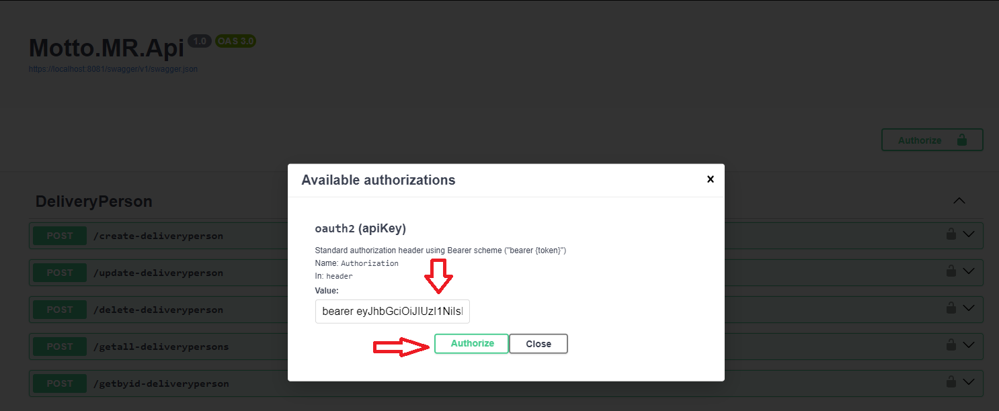
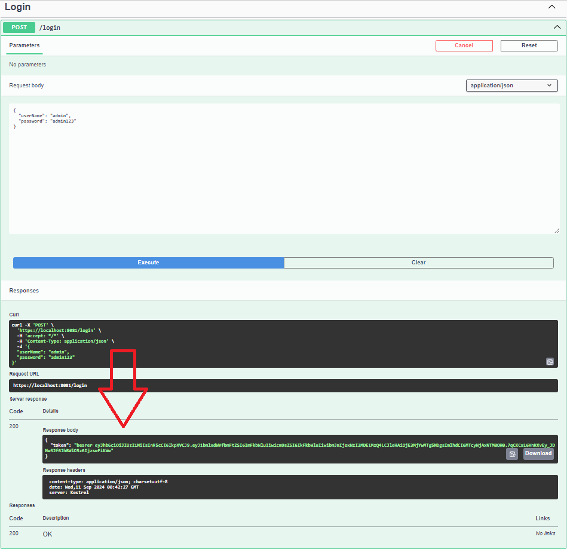

# Desafio backend Motto.MR.
Seja muito bem-vindo ao desafio backend da Motto.MR, obrigado pelo interesse em fazer parte do nosso time e ajudar a melhorar a vida de milhares de pessoas.

## Instruções
- O desafio é válido para diversos níveis, portanto não se preocupe se não conseguir resolver por completo.
- A aplicação só será avaliada se estiver rodando, se necessário crie um passo a passo para isso.
- Faça um clone do repositório em seu git pessoal para iniciar o desenvolvimento e não cite nada relacionado a Motto.MR.
- Após finalização envie um e-mail para o recrutador informando o repositório para análise.
  
## Requisitos não funcionais 
- A aplicação deverá ser construida com .Net utilizando C#.
- Utilizar apenas os seguintes bancos de dados (Postgress, MongoDB)
    - Não utilizar PL/pgSQL
- Escolha o sistema de mensageria de sua preferencia( RabbitMq, Sqs/Sns , Kafka, Gooogle Pub/Sub ou qualquer outro)

## Aplicação a ser desenvolvida
Seu objetivo é criar uma aplicação para gerenciar aluguel de motos e entregadores. Quando um entregador estiver registrado e com uma locação ativa poderá também efetuar entregas de pedidos disponíveis na plataforma.
### Casos de uso
- Eu como usuário admin quero cadastrar uma nova moto.
  - Os dados obrigatórios da moto são Identificador, Ano, Modelo e Placa
  - A placa é um dado único e não pode se repetir.
  - Quando a moto for cadastrada a aplicação deverá gerar um evento de moto cadastrada
    - A notificação deverá ser publicada por mensageria.
    - Criar um consumidor para notificar quando o ano da moto for "2024"
    - Assim que a mensagem for recebida, deverá ser armazenada no banco de dados para consulta futura.
- Eu como usuário admin quero consultar as motos existentes na plataforma e conseguir filtrar pela placa.
- Eu como usuário admin quero modificar uma moto alterando apenas sua placa que foi cadastrado indevidamente
- Eu como usuário admin quero remover uma moto que foi cadastrado incorretamente, desde que não tenha registro de locações.
- Eu como usuário entregador quero me cadastrar na plataforma para alugar motos.
    - Os dados do entregador são( identificador, nome, cnpj, data de nascimento, número da CNHh, tipo da CNH, imagemCNH)
    - Os tipos de cnh válidos são A, B ou ambas A+B.
    - O cnpj é único e não pode se repetir.
    - O número da CNH é único e não pode se repetir.
- Eu como entregador quero enviar a foto de minha cnh para atualizar meu cadastro.
    - O formato do arquivo deve ser png ou bmp.
    - A foto não poderá ser armazenada no banco de dados, você pode utilizar um serviço de storage( disco local, amazon s3, minIO ou outros).
- Eu como entregador quero alugar uma moto por um período.
    - Os planos disponíveis para locação são:
        - 7 dias com um custo de R$30,00 por dia
        - 15 dias com um custo de R$28,00 por dia
        - 30 dias com um custo de R$22,00 por dia
        - 45 dias com um custo de R$20,00 por dia
        - 50 dias com um custo de R$18,00 por dia
    - A locação obrigatóriamente tem que ter uma data de inicio e uma data de término e outra data de previsão de término.
    - O inicio da locação obrigatóriamente é o primeiro dia após a data de criação.
    - Somente entregadores habilitados na categoria A podem efetuar uma locação
- Eu como entregador quero informar a data que irei devolver a moto e consultar o valor total da locação.
    - Quando a data informada for inferior a data prevista do término, será cobrado o valor das diárias e uma multa adicional
        - Para plano de 7 dias o valor da multa é de 20% sobre o valor das diárias não efetivadas.
        - Para plano de 15 dias o valor da multa é de 40% sobre o valor das diárias não efetivadas.
    - Quando a data informada for superior a data prevista do término, será cobrado um valor adicional de R$50,00 por diária adicional.
    

## Diferenciais 🚀
- Testes unitários
- Testes de integração
- EntityFramework e/ou Dapper
- Docker e Docker Compose
- Design Patterns
- Documentação
- Tratamento de erros
- Arquitetura e modelagem de dados
- Código escrito em língua inglesa
- Código limpo e organizado
- Logs bem estruturados
- Seguir convenções utilizadas pela comunidade


## Instruções para configuração do ambiente.

Ir no diretório Motto.MR.Api e executar o comando abaixo:
```
docker compose --project-name mottomr-api up -d
```  

Aguardar pelo menos 30 segundos para RabbitMQ ficar operante através do healthcheck.
  O RabbitMqConsumerService está sendo executado em BackgroundService quando Web Api sobe.

Abra o browser para os testes com swagger no link abaixo:
```
https://localhost:8081/swagger/index.html
```

## Instruções para o teste com swagger para o controle "DeliveryPerson" (Entregador).

Exemplo: Input para o método de login como entregador.
```
{
  "userName": "delivery",
  "password": "delivery123"
}

```

No **Response body** teremos o token de autorização do entregador para ser usado nos outros métodos com validade de 1 hora.

**{**
  **"token": "bearer eyJhbGciOiJIUzI1NiIsInR5cCI6IkpXVCJ9.eyJ1bmlxdWVf..."**
**}**


Copie esse esse token **bearer eyJhbGciOiJIUzI1NiIsInR5cCI6IkpXVCJ9.eyJ1bmlxdWVf...** e inclua no **Authorize**. Conforme a figura abaixo: 



Exemplo: Input para o método "create-deliveryperson". Para esse controle é preciso fazer o login como **"delivery"** (Entregador) e senha **delivery123** e informar o token no **Authorize**.
```
{
  "deliveryPerson": {
    "name": "Alvaro",
    "cnpj": "10024587890",
    "birthDate": "1970-09-04T19:36:34.065Z",
    "driverLicenseNumber": "123578",
    "driverLicenseType": "A",
    "driverLicenseImageBase64": "data:image/png;base64,iVBORw0KGgoAAAANSUhEUgAAABgAAAAYCAYAAADgdz34AAAABHNCSVQICAgIfAhkiAAAAAlwSFlzAAAApgAAAKYB3X3/OAAAABl0RVh0U29mdHdhcmUAd3d3Lmlua3NjYXBlLm9yZ5vuPBoAAANCSURBVEiJtZZPbBtFFMZ/M7ubXdtdb1xSFyeilBapySVU8h8OoFaooFSqiihIVIpQBKci6KEg9Q6H9kovIHoCIVQJJCKE1ENFjnAgcaSGC6rEnxBwA04Tx43t2FnvDAfjkNibxgHxnWb2e/u992bee7tCa00YFsffekFY+nUzFtjW0LrvjRXrCDIAaPLlW0nHL0SsZtVoaF98mLrx3pdhOqLtYPHChahZcYYO7KvPFxvRl5XPp1sN3adWiD1ZAqD6XYK1b/dvE5IWryTt2udLFedwc1+9kLp+vbbpoDh+6TklxBeAi9TL0taeWpdmZzQDry0AcO+jQ12RyohqqoYoo8RDwJrU+qXkjWtfi8Xxt58BdQuwQs9qC/afLwCw8tnQbqYAPsgxE1S6F3EAIXux2oQFKm0ihMsOF71dHYx+f3NND68ghCu1YIoePPQN1pGRABkJ6Bus96CutRZMydTl+TvuiRW1m3n0eDl0vRPcEysqdXn+jsQPsrHMquGeXEaY4Yk4wxWcY5V/9scqOMOVUFthatyTy8QyqwZ+kDURKoMWxNKr2EeqVKcTNOajqKoBgOE28U4tdQl5p5bwCw7BWquaZSzAPlwjlithJtp3pTImSqQRrb2Z8PHGigD4RZuNX6JYj6wj7O4TFLbCO/Mn/m8R+h6rYSUb3ekokRY6f/YukArN979jcW+V/S8g0eT/N3VN3kTqWbQ428m9/8k0P/1aIhF36PccEl6EhOcAUCrXKZXXWS3XKd2vc/TRBG9O5ELC17MmWubD2nKhUKZa26Ba2+D3P+4/MNCFwg59oWVeYhkzgN/JDR8deKBoD7Y+ljEjGZ0sosXVTvbc6RHirr2reNy1OXd6pJsQ+gqjk8VWFYmHrwBzW/n+uMPFiRwHB2I7ih8ciHFxIkd/3Omk5tCDV1t+2nNu5sxxpDFNx+huNhVT3/zMDz8usXC3ddaHBj1GHj/As08fwTS7Kt1HBTmyN29vdwAw+/wbwLVOJ3uAD1wi/dUH7Qei66PfyuRj4Ik9is+hglfbkbfR3cnZm7chlUWLdwmprtCohX4HUtlOcQjLYCu+fzGJH2QRKvP3UNz8bWk1qMxjGTOMThZ3kvgLI5AzFfo379UAAAAASUVORK5CYII="
  }
}
```

Exemplo: Para o método "getall-deliverypersons" não é preciso enviar parâmetros. Para esse controle é preciso informar fazer o login como **"delivery"** (Entregador) e senha **delivery123** e informar o token no **Authorize** funciona também para administrador.
```
No parameters
```

Exemplo: Input para o método "getbyid-deliveryperson". Para esse controle é preciso informar fazer o login como **"delivery"** (Entregador) e senha **delivery123** e informar o token no **Authorize** funciona também para administrador..
```
{
  "id": 1
}
```

Exemplo: Input para o método "delete-deliveryperson". Para esse controle é preciso informar fazer o login como **"delivery"** (Entregador) e senha **delivery123** e informar o token no **Authorize** funciona também para administrador..
```
{
  "id": 1
}
```

## Instruções para o teste com swagger para o controle "Motorcycle" (Moto).

Exemplo: Input para o método de login como administrador.
```
{
  "userName": "admin",
  "password": "admin123"
}
```

No **Response body** teremos o token de autorização do entregador para ser usado nos outros métodos com validade de 1 hora.

**{**
  **"token": "bearer eyJhbGciOiJIUzI1NiIsInR5cCI6IkpXVCJ9.eyJ1bmlxdWVf..."**
**}**




Copie esse esse token **bearer eyJhbGciOiJIUzI1NiIsInR5cCI6IkpXVCJ9.eyJ1bmlxdWVf...** e inclua no **Authorize**. Conforme a figura abaixo: 


Exemplo: Input para o método "create-motorcycle". Para esse controle é preciso fazer o login como **"admin"** (Administrador) e senha **admin123** e informar o token no **Authorize**.
```
{
  "motorcycle": {
    "identifier": "moto123",
    "year": 2024,
    "model": "Sport 110i",
    "licensePlate": "NCY-2517"
  }
}
```

Exemplo: Para o método "getall-motorcycles" não é preciso enviar parâmetros. Para esse controle é preciso fazer o login como **"admin"** (Administrador) e senha **admin123** e informar o token no **Authorize**.
```
No parameters
```

Exemplo: Input para o método "update-motorcycle". Para esse controle é preciso fazer o login como **"admin"** (Administrador) e senha **admin123** e informar o token no **Authorize**.
```
{
  "id": 1,
  "motorcycle": {
    "identifier": "moto123",
    "year": 2024,
    "model": "Sport 110i",
    "licensePlate": "NCY-8840"
  }
}
```
